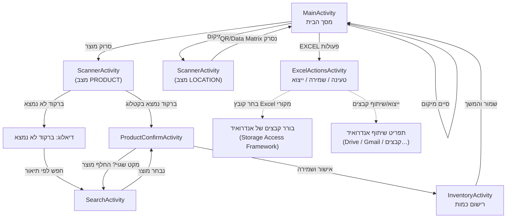
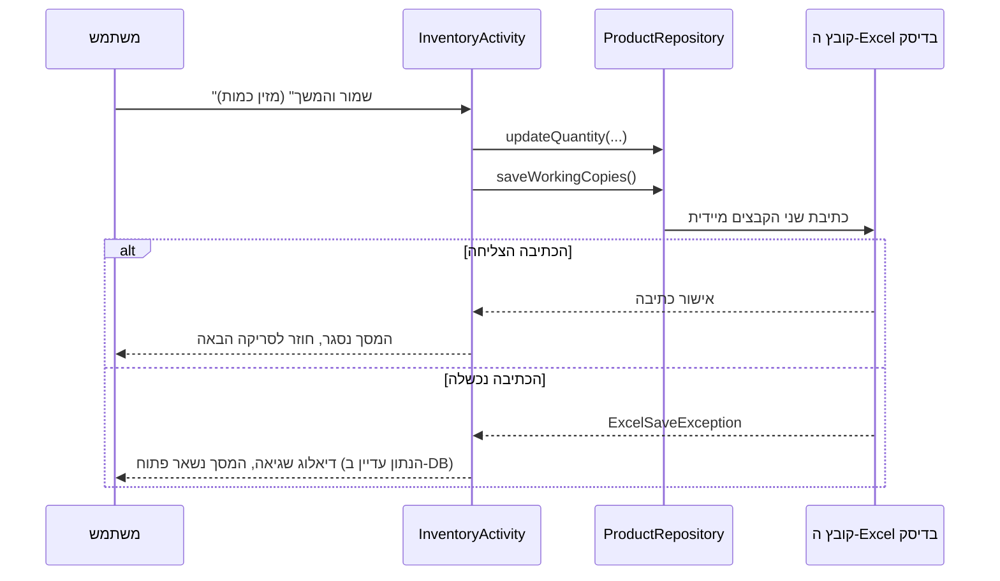

# ארכיטקטורה

תיעוד זה משקף את הקוד בפועל בענף `main` של המאגר (קבצים תחת
`app/src/main/java/com/warehouse/stockscanner/`). כל טענה כאן מגובה בשם קובץ/מחלקה קונקרטי
כדי שאפשר יהיה לאמת אותה מול הקוד בכל רגע.

## שכבות הקוד

```
app/src/main/java/com/warehouse/stockscanner/
├── MainActivity.kt              מסך הבית — תזמור הזרימה, מצב "מיקום פעיל"
├── ScannerActivity.kt           מסך סריקה (CameraX + ML Kit) — למיקום ולמוצר
├── ProductConfirmActivity.kt    מסך אישור/עריכה של מוצר שנסרק
├── InventoryActivity.kt         מסך רישום כמות (יחידות / אריזות / מעורב)
├── SearchActivity.kt            חיפוש סלחני לפי תיאור (כשברקוד לא נמצא)
├── SearchResultAdapter.kt       Adapter משותף לרשימות תוצאות/מוצרים
├── ExcelActionsActivity.kt      מסך נפרד לכל מה שקשור ל־Excel (טעינה/שמירה/ייצוא)
├── StockScannerApp.kt           Application — יוצר את מסד הנתונים והריפוזיטורי פעם אחת
├── data/
│   ├── ProductEntity.kt         שורת מוצר (Room @Entity)
│   ├── BarcodeAliasEntity.kt    ברקוד נוסף המקושר למקט קיים (Room @Entity)
│   ├── ProductDao.kt            שאילתות SQL על טבלת המוצרים
│   ├── BarcodeAliasDao.kt       שאילתות SQL על טבלת ה־aliases
│   ├── AppDatabase.kt           הגדרת מסד הנתונים (Room, גרסה 7 + מיגרציות)
│   ├── ProductRepository.kt     כל הלוגיקה העסקית — נקודת הכניסה היחידה מהמסכים לנתונים
│   ├── SessionPrefs.kt          מצב מושב קטן (SharedPreferences): איזה קובץ טעון, מיקום פעיל…
│   └── WorkingFileNaming.kt     בניית שמות שני קבצי העבודה מתוך שם הקובץ המקורי
├── excel/
│   ├── ExcelReader.kt           קורא XLSX ידני (ללא Apache POI)
│   ├── ExcelWriter.kt           כותב XLSX ידני (ללא Apache POI)
│   ├── ExcelColumns.kt          המרות אות⇄אינדקס עמודה ("A"↔0, "AA"↔26…)
│   └── ExcelSaveException.kt    חריגה ייעודית לכשלון כתיבה פיזית
└── util/
    ├── SearchUtils.kt           חיפוש טקסט חופשי וסלחני לפי תיאור
    └── Dialogs.kt               דיאלוג שגיאה משותף (showErrorDialog)
```

**כלל ברזל בקוד:** כל שכבת ה־UI (ה־`Activity`-ים) פונה אך ורק ל־`ProductRepository` לצורך קריאה/כתיבה
של נתונים — אף מסך לא נוגע ישירות ב־DAO או בקובצי ה־Excel. זה מה שמבטיח שההתנהגות ("שמור-בפועל
לפני שמדווחים הצלחה") עקבית בכל המסכים.

## מפת המסכים והניווט



- לכל חץ בדיאגרמה יש כלל התנהגות מדויק בעמוד [התנהגות האפליקציה לכל פעולה](behavior.md).
- לאחר אישור מוצר (`ProductConfirmActivity` → `InventoryActivity` → שמירה) האפליקציה **חוזרת
  אוטומטית למסך סריקת המוצר הבא** (ראו `productConfirmLauncher` ב־`MainActivity.kt:64`) — לא צריך
  ללחוץ שוב על "סרוק מוצר" לכל פריט באותו מדף.

## מודל הנתונים {#data-model}

### טבלת `products` — `ProductEntity`

כל "שורה" מייצגת שילוב אחד ויחיד של **(מקט, מיקום, ברקוד)**. **מקט אינו ייחודי בפני עצמו** —
אותו מקט יכול להופיע בכמה שורות: פעם לכל מיקום שבו הוא נמצא, ואפילו כמה שורות באותו מיקום ממש
אם נסרקו עבורו כמה ברקודים שונים שם (למשל מדבקה ישנה + מדבקה חדשה).

| שדה | טיפוס | משמעות |
|---|---|---|
| `id` | Long | מפתח ראשי (autoIncrement) — המזהה האמיתי של השורה |
| `sku` (מקט) | String | תמיד טקסט — כדי לא לאבד אפסים מובילים (`"0001234"`) או תווים לא־מספריים |
| `description` (תאור) | String | מתעדכן בו־זמנית על כל שורות אותו מקט בכל סריקה |
| `barcode` (ברקוד) | String | **שייך לשורה עצמה**, לא למקט כמכלול |
| `location` (מיקום) | String | ריק = עדיין לא שובץ למדף |
| `rowOrder` | Int | סדר הכתיבה החוזר לקובץ ה־Excel |
| `quantityType` | String | `"יחידות"`, `"אריזות"` או `"מעורב"` |
| `packageContent`, `packageCount` | Int | תכולת אריזה × מספר אריזות (רק ב־`"אריזות"` וב־`"מעורב"`) |
| `looseUnits` | Int | יחידות בודדות שמונחות ליד האריזות (רק ב־`"מעורב"`; 0 בשאר המצבים) |
| `quantity` | Int | כמות היחידות הסופית — תמיד מחושבת, בכל שלושת המצבים (`ProductEntity.totalUnits`) |
| `scanned` | Boolean | `true` רק אם השורה אושרה בפועל דרך סריקה באפליקציה — ראו [קובץ המיקומים](#excel-files) |

אינדקס ייחודי: **`UNIQUE(sku, location, barcode)`**. משמעות מעשית: סריקה חוזרת של אותו
(מקט, מיקום, ברקוד) בדיוק — לא יוצרת שורה כפולה, רק "מאשרת מחדש" את הקיימת.

### טבלת `barcode_aliases` — `BarcodeAliasEntity`

ברקוד **נוסף** שמקושר למקט שכבר יש לו ברקוד ראשי — כדי שכמה ברקודים פיזיים שונים (מדבקת ספק,
ברקוד ארגז וכו') יפתרו לאותו מוצר. `barcode` ייחודי (אותו ברקוד לא יכול להיות alias של שני
מקטים שונים), אבל מקט יכול לצבור כמה aliases.

### עדכון נתונים — `ProductRepository.updateProduct()`

זו **הפונקציה היחידה** שמסמנת שורה כ־`scanned = true`, ולכן היחידה שבאמת "מבצעת" סריקה מבחינת
המערכת. לוגיקת ה־ADD-only (לעולם לא דורסת נתון קיים):

1. **אם קיימת כבר שורה מדויקת** ל־(מקט, מיקום, ברקוד) — היא רק מסומנת `scanned = true` (אישור חוזר).
2. **אחרת, אם יש שורה "ריקה"** (בלי מיקום, עם ברקוד ריק או זהה לנסרק) — היא מתמלאת עם המיקום/ברקוד
   החדשים, כדי לא להשאיר שורת קטלוג יתומה לצד שורה חדשה.
3. **אחרת — נפתחת שורה חדשה** (שיבוץ במיקום נוסף, ברקוד שונה באותו מיקום, וכו').

**הכמות אף פעם לא נגררת לשיבוץ חדש.** בשני המקרים שבהם שורה משובצת למדף לראשונה (2 ו־3) היא
מקבלת רק את זהות המוצר, והכמות שלה מתחילה מ־0 במצב `"יחידות"` — בין אם המקור הוא ספירה שנעשתה
במדף *אחר* (שכפול) ובין אם זו כמות שהגיעה מקובץ המקור על שורה שמעולם לא שובצה. השורה מסומנת
`scanned = true` ולכן נכתבת מיד לקובץ המיקומים, כך שגרירת כמות הייתה מדווחת יחידות שאיש לא ספר
שם. רק `updateQuantity` — כלומר מסך המלאי — כותב ספירה על שורה. מקרה 1 (אישור חוזר של אותה
שורה בדיוק) הוא היחיד ששומר את הכמות, כי היא באמת נספרה שם.

פעולות קשורות באותה מחלקה: `reassignBarcode` (שינוי שיוך ברקוד→מקט שגוי), `removeFromLocation`
(ביטול שיבוץ — מוחקת את השורה אם למקט יש שורות נוספות, או מנקה אותה חזרה לריקה אם זו השורה היחידה),
`updateQuantity` (כמות על שורה קיימת בלבד — לא יוצרת שורה).

## קבצי Excel {#excel-files}

לאפליקציה **שלושה** קבצי Excel שונים בתפקידים שונים לגמרי — הבחנה קריטית להבנת האפליקציה:

| קובץ | מי כותב אליו | מתי נוצר/נכתב |
|---|---|---|
| **קובץ המקור** שהמשתמש בוחר (`בחר קובץ Excel מקורי`) | נקרא **פעם אחת בלבד**, לעולם לא נכתב עליו שוב | בבחירה דרך בורר קבצים (SAF) |
| **קובץ מיקומים וכמויות** (`..._original_locations_quantities.xlsx`) | `ExcelWriter.writeLocationsQuantitiesToStream` | ראו למטה — נכתב **תמיד יחד** עם קובץ הברקודים המרובים |
| **קובץ ברקודים מרובים** (`..._original_multiple_barcodes.xlsx`) | `ExcelWriter.writeMultipleBarcodesToStream` | ראו למטה — נכתב **תמיד יחד** עם קובץ המיקומים והכמויות |

`ProductRepository.saveWorkingCopies()` כותב **שני הקבצים יחד, תמיד** — אין מצב שרק אחד מהם
מתעדכן:

```kotlin
suspend fun saveWorkingCopies() {
    saveLocationsQuantitiesFile()
    saveMultipleBarcodesFile()
}
```

והיא נקראת משלוש נקודות כניסה: **בכל סריקה שאושרה** (`InventoryActivity.saveAndFinish()`),
**ב"סיים מיקום"** (`MainActivity.finishLocation()`), ו**ב"שמור Excel"**
(`ExcelActionsActivity.saveExcel()`) — וכן, בנפרד, בטעינת קובץ מקור חדש
(`ProductRepository.createWorkingFiles()` קוראת לשתי הפונקציות המפורדות ישירות). הכפתורים
"צור/עדכן קובץ מיקומים וכמויות" ו"צור/עדכן קובץ ברקודים מרובים" הם היחידים שכותבים **רק** קובץ
אחד בכוונה — ראו [הטבלה בהמשך](#excel-actions-buttons).

שני קבצי העבודה נשמרים ב**אחסון הפרטי של האפליקציה** (`context.filesDir`) ולא במקום גלוי
למשתמש — בחירה מכוונת שחוסכת בקשות הרשאה לאחסון. הדרך היחידה להוציא אותם מהאפליקציה היא כפתור
**"ייצוא/שיתוף קבצים"**, שמשתמש ב־`FileProvider` (מוגדר ב־`AndroidManifest.xml` + `res/xml/file_paths.xml`)
כדי לפתוח את תפריט השיתוף הרגיל של אנדרואיד (Drive, Gmail, "שמור למכשיר"…).

### שם הקובץ נבנה כך (`WorkingFileNaming.kt`)

```
<YYYY-MM-DD>_<שם הקובץ המקורי מנוקה>_original_locations_quantities.xlsx
<YYYY-MM-DD>_<שם הקובץ המקורי מנוקה>_original_multiple_barcodes.xlsx
```

השם נקבע **פעם אחת**, ברגע שקובץ המקור נטען, ואז נשמר ב־`SessionPrefs` — כל שמירה נוספת (סריקה,
"סיים מיקום", "שמור Excel") כותבת לאותו קובץ בדיוק, לא יוצרת קובץ חדש כל פעם.

### מתי בדיוק נכתב קובץ המיקומים והכמויות (סדר עדיפות) {#write-timing}



חשוב להבין: **השמירה בפועל מתבצעת אחרי כל סריקה בודדת** (`InventoryActivity.saveAndFinish()`),
**לא** רק בלחיצה על "סיים מיקום". "סיים מיקום" (`MainActivity.finishLocation()`) הוא כתיבה חוזרת
נוספת — "רשת ביטחון" סופית — ולא הטריגר היחיד לשמירה. ראו
[PR #9](https://github.com/nathanemuyal/StockScanner/pull/9) לרקע ההיסטורי על השינוי הזה
(מ"שמירה רק בסיום מדף" ל"שמירה אחרי כל סריקה בודדת").

### קובץ המיקומים והכמויות הוא **יומן**, לא עותק של הקטלוג

`saveLocationsQuantitiesFile()` כותב רק שורות עם `scanned = true` (`dao.getScannedOrdered()`).
כלומר: מוצר שהגיע מקובץ המקור עם עמודת "מיקום" כבר מלאה — **לא** יופיע בקובץ הפלט עד שהוא
נסרק בפועל באפליקציה. זה מבטיח שקובץ הפלט משקף אך ורק מה שבאמת נספר במחסן.

### פורמט העמודות (זהה לקריאה ולכתיבה)

**קובץ המקור / קובץ המיקומים והכמויות** — עמודות (בכל סדר, מזוהות לפי שם כותרת):

| עמודה | שדה | חובה בקובץ המקור? |
|---|---|---|
| `מקט` | sku | כן |
| `תאור` | description | כן |
| `ברקוד` | barcode | כן |
| `מיקום` (או `מיקום 2`, `מיקום 3`… לתאימות לאחור) | location | כן (לפחות עמודת `מיקום` אחת) |
| `סוג כמות` | quantityType | לא — ברירת מחדל `"יחידות"` |
| `תכולת אריזה` | packageContent | לא — ברירת מחדל 0 |
| `כמות אריזות` | packageCount | לא — ברירת מחדל 0 |
| `יחידות בודדות` | looseUnits | לא — ברירת מחדל 0; נקרא רק כש־`סוג כמות` הוא `"מעורב"` |
| `כמות יחידות` | quantity | לא — ברירת מחדל 0 |

**קובץ ברקודים מרובים** — עמודות: `מקט`, `תאור`, `ברקוד` (ברקוד אחד נוסף לכל שורה).

!!! note "פרטי מימוש XLSX"
    ה־Reader/Writer כתובים מאפס מעל `java.util.zip` ו־`XmlPullParser` המובנה של אנדרואיד —
    **בלי** ספריית Apache POI, שידועה כבעייתית על אנדרואיד (תלות ב־AWT). כל תא נכתב כ־
    `t="inlineStr"` (לא כמספר) כדי שמקט כמו `"00042"` תמיד ישמור את האפסים המובילים שלו.
    נקרא רק **הגיליון הראשון** של קובץ המקור כרשימת המוצרים — פרט לגיליון **שני**, שאם קיים
    ויש לו כותרות `מקט`/`ברקוד` מזוהה אוטומטית כ"ברקודים כפולים" (`ExcelReader.parseAliasSheet`).
    גיליון שלישי ואילך, וכל גיליון שני שאינו תואם את הכותרות האלה, מתעלמים ממנו לגמרי.

## מסך "פעולות Excel" — כל כפתור וממה הוא כותב {#excel-actions-buttons}

`ExcelActionsActivity` הוא המסך היחיד שנוגע בקובץ המקור ובכפתורי שמירה/ייצוא מפורשים:

| כפתור | קורא ל־ | תוצאה |
|---|---|---|
| בחר קובץ Excel מקורי | `repository.loadFromExcel()` | מוחק את כל הנתונים הקיימים, טוען את הקובץ החדש, **יוצר מיד** את שני קבצי העבודה |
| שמור Excel | `repository.saveWorkingCopies()` | כותב מחדש את **שני** קבצי העבודה מהמצב הנוכחי ב־DB |
| צור/עדכן קובץ מיקומים וכמויות | `repository.saveLocationsQuantitiesFile()` | כותב **רק** את קובץ המיקומים |
| צור/עדכן קובץ ברקודים מרובים | `repository.saveMultipleBarcodesFile()` | כותב **רק** את קובץ הברקודים |
| ייצוא/שיתוף קבצים | `FileProvider` + `Intent.ACTION_SEND_MULTIPLE` | פותח את תפריט השיתוף של אנדרואיד עם שני קבצי העבודה הקיימים |

## שכבת האחסון המקומי (Room)

`AppDatabase` (גרסה 7) מכילה את שתי הטבלאות שלמעלה. הבחירה ב־
Room (SQLite) על פני שמירה רק בזיכרון היא הסיבה **שסגירת האפליקציה באמצע עבודה לא מאבדת נתונים
שכבר אושרו** — רק `SessionPrefs.currentLocation` (המיקום הפעיל הנוכחי) מתאפס, כי הוא נשמר
ב־SharedPreferences ולא בטבלת המוצרים.

מאותה סיבה בדיוק, **שינוי סכמה מגיע עם מיגרציה אמיתית** כשאפשר: עדכון האפליקציה באמצע ספירה לא
אמור להיות הדבר היחיד שמוחק את מה שכבר נסרק. `MIGRATION_6_7` מוסיפה את העמודה `looseUnits`
(מצב "מעורב") עם ברירת מחדל 0 — הערך הנכון לכל שורה שנספרה באחד משני המצבים הישנים, שבהם אין
יחידות בודדות. `fallbackToDestructiveMigration` נשאר רק כמוצא אחרון למסלול שדרוג שאף מיגרציה לא
מכסה. `AppDatabaseMigrationTest` מריץ את המיגרציה על קובץ v6 אמיתי — **בלי** ה־fallback, כדי
שמיגרציה חסרה או שגויה תיפול בבדיקה במקום למחוק טבלה בשקט.

## סריקה — CameraX + ML Kit (`ScannerActivity`)

- **מצב מיקום (`MODE_LOCATION`)**: מזהה **רק** `QR_CODE` ו־`DATA_MATRIX`. החלטה מכוונת: תוויות
  מדף אמיתיות (מצולמות בשטח) התבררו כ־Data Matrix, לא QR — ושני הסוגים מזוהים כדי שכל תווית
  תעבוד, בעוד פורמטים חד־ממדיים (ברקודי מוצר) מוחרגים לגמרי, כדי שברקוד מוצר שנקלט באותו פריים
  לא ייחשב בטעות למיקום.
- **מצב מוצר (`MODE_PRODUCT`)**: מזהה גם 2D (QR/Data Matrix) וגם 1D נפוצים — `EAN-13`, `EAN-8`,
  `UPC-A`, `UPC-E`, `Code 128`, `Code 39`.
- הסריקה משתמשת ב־`AtomicBoolean` כדי לוודא שרק תוצאה **אחת** מטופלת גם אם כמה פריימים נסרקים
  כמעט בו־זמנית.
- **דיוק הסריקה** (חבילת `scan/`). כל פריים עובר את השלבים האלה לפני שערך מתקבל:
    1. `MultiPassScanner` — פענוח בעד שלושה מעברים: הפריים המלא, חצי מרכזי, רבע מרכזי (החיתוכים
       רק אם המעבר הקודם לא מצא כלום). ML Kit מקטין פריים גדול לפני החיפוש, כך שברקוד קטן/רחוק
       נעלם: באמולטור, ברקודים קטנים בתוך פריים 1920×1080 זוהו 46% בלי החיתוכים ו־100% איתם.
       (הגדלת החיתוכים והחדדה נמדדו גם הם — בלי שיפור, ולכן לא נכללו.)
    2. `BarcodeValidator` — פוסל ערכים שלא יכולים להיות קריאה שלמה: ספרת ביקורת GS1 ל־EAN-13/EAN-8/UPC-A,
       הרחבה ל־UPC-A ובדיקה ל־UPC-E, ומינימום 4 תווים ל־Code 128/39 (שאין להם ספרת ביקורת חובה).
       תו ASCII 29 (מפריד שדות של GS1, גם בתחילת הערך) הוא חלק מהערך ונשמר.
    3. `QuietZoneCheck` — ל־EAN/UPC חייב להיות שטח ריק לפני ואחרי הפסים. קריאה שיש לה פסים מעבר
       לקצוות היא **קטע** מברקוד ארוך יותר (נמצא באמולטור: UPC-E `12180998` מתוך EAN-13
       מטושטש — עם ספרת ביקורת תקינה, ואותו דבר בכל פריים). EAN-8/UPC-E דורשים שטח ריק בשני
       הצדדים; EAN-13/UPC-A נפסלים רק כשיש פסים בשני הצדדים (כדי שאצבע או טקסט בצד אחד לא יפילו).
    4. `ShelfLabelFilter` (מצב מוצר בלבד) — קוד 2D שהוא תווית המדף הנוכחית, או באותה "צורה"
       (אורך, ספרות/אותיות/מפרידים באותם מקומות — למשל המדף הסמוך), לא נקלט כמוצר.
    5. `AimSelector` — כשכמה קודים בפריים (תווית מדף נושאת **ארבעה** Data Matrix, ולידה ברקודי
       מוצרים), נבחר הקוד שנמצא מתחת למרכז המסגרת, אחרת הקרוב ביותר למרכז. בעבר נלקח "הראשון"
       שה־ML Kit החזיר — סדר שרירותי, ולכן לעיתים נקלט קוד אחר מזה שכוונו אליו.
    6. `ScanConsensus` — קוד 1D מתקבל רק אחרי **שני פריימים תואמים** (כ־70ms). ספרת ביקורת תופסת
       רק שגיאה בספרה אחת; קריאה שגויה עם ספרת ביקורת תקינה נמצאה בפועל בתמונות מהמחסן. QR/Data
       Matrix כוללים תיקון שגיאות ולכן מתקבלים מפריים אחד.
- רזולוציית הניתוח היא 1920×1080 (במקום 1280×720) כדי שהפסים הדקים של EAN יישארו קריאים גם
  ממרחק, בפורמט RGBA כדי שהפריים יהפוך ישירות ל־Bitmap שאפשר לחתוך; לחיצה על התצוגה ממקדת ומודדת חשיפה בנקודה; ו־ML Kit רשאי להגדיל זום אוטומטית (עד ×4)
  כשהקוד קטן מדי לפענוח.
- אותו `Camera` שמתקבל מ־`bindToLifecycle()` (session ה־CameraX היחיד של המסך) משמש גם לפנס:
  `cameraInfo.hasFlashUnit()` קובע אם כפתור הפנס מוצג בכלל, ו־`cameraControl.enableTorch()`
  מדליק/מכבה אותו — בלי session נפרד ובלי הרשאה נוספת. הכפתור לא מחזיק מצב "דלוק/כבוי" משלו;
  הטקסט שלו נגזר תמיד מ־`cameraInfo.torchState` (LiveData), כדי להישאר נכון גם כש־CameraX מאפס
  את הפנס לבד עם `ON_STOP` (שיחה נכנסת, נעילת מסך) ולא רק דרך לחיצה על הכפתור.
- זיהוי מוצלח (בכל מצב) מפעיל רטט קצר (50ms) דרך `Vibrator`/`VibratorManager`, עם usage מסומן
  כמשוב מגע (`VibrationAttributes.USAGE_TOUCH` מ־API 33, `AudioAttributes.USAGE_ASSISTANCE_SONIFICATION`
  לפני זה) — כדי שעובד שסורק בלי להביט במסך בכל פעם יקבל אישור לא-ויזואלי מיידי.
- `ScanAccuracyTest` (androidTest) מריץ את ה־pipeline המלא עם מנוע ML Kit האמיתי על תמונות המחסן
  ועל תמונות ברקודים ממוצרים ישראליים מ־Wikimedia Commons (`assets/accuracy/ATTRIBUTION.md`),
  ועל ברקודים קטנים/ברזולוציה נמוכה, ודורש **אפס** ערכים שגויים ו־95% זיהוי.

## טיפול בשגיאות — עיקרון מרכזי

`ExcelSaveException` הוא סוג חריגה ייעודי לכשל כתיבה פיזית (למשל אחסון מלא). **בכל מקום** שבו
נזרקת החריגה הזו — `InventoryActivity`, `MainActivity.finishLocation()`, `ExcelActionsActivity` —
חל אותו כלל: מוצג `showErrorDialog(...)` עם ההודעה, **והמסך לא נסגר**. הנתון עצמו תמיד כבר
נשמר בהצלחה במסד הנתונים המקומי (Room) לפני הניסיון לכתוב את קובץ ה־Excel, כך שכשל בכתיבת
הקובץ **לעולם לא** גורם לאובדן מידע — רק לכך שהעדכון עדיין לא השתקף בקובץ הפיזי.
