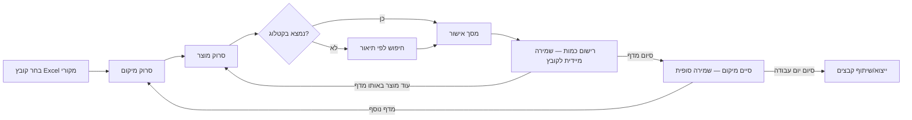

# מדריך שימוש למשתמש

מדריך זה מוביל אתכם צעד־אחר־צעד בזרימת העבודה המלאה: מטעינת קובץ Excel ועד לייצוא הקבצים
המעודכנים בסוף היום. הצילומים המסומנים **"צילום מסך אמיתי"** צולמו ישירות מהאפליקציה הרצה;
המסכים שתלויים במצלמה פיזית (סריקה, אישור מוצר, ניהול מלאי, חיפוש) מוצגים כ**תרשים סכמטי**
נאמן לטקסטים ולכפתורים בפועל בקוד (ולא כצילום מצלמה אמיתי, מטעמים מובנים).

!!! tip "לפני שמתחילים"
    ודאו שיש לכם קובץ `.xlsx` עם העמודות `מקט`, `תאור`, `ברקוד`, `מיקום` (בכל סדר עמודות —
    האפליקציה מזהה אותן לפי שם הכותרת, לא לפי מיקום). ראו את [כל הדרישות המדויקות](correct-usage.md#source-requirements).

## שלב 1 — מסך הבית לפני טעינת קובץ

בהפעלה ראשונה (או אחרי טעינת קובץ חדש) מסך הבית מציג "לא נבחר" קובץ, 0 מוצרים, ואין מיקום פעיל.
בשלב הזה זמין רק כפתור אחד: **"Excel פעולות"**.

<figure>

<figcaption>צילום מסך אמיתי — מסך הבית, לפני טעינת קובץ</figcaption>
</figure>

## שלב 2 — בחירת קובץ Excel מקורי

לוחצים **"Excel פעולות"**, ואז **"בחר קובץ Excel מקורי"**. נפתח בורר הקבצים הרגיל של אנדרואיד
(Storage Access Framework) — אפשר לבחור מכל מקור: אחסון פנימי, Drive, מייל וכו'.

<figure>

<figcaption>צילום מסך אמיתי — מסך "פעולות Excel" לפני טעינת קובץ</figcaption>
</figure>

ברגע שנבחר קובץ תקין, האפליקציה **מיד**:

1. מוחקת את כל נתוני העבודה הקודמים (אם היו).
2. טוענת את השורות מהקובץ החדש.
3. יוצרת מייד שני קבצי עבודה חדשים ("מיקומים וכמויות" ו"ברקודים מרובים").

<figure>

<figcaption>צילום מסך אמיתי — אחרי טעינה: שמות שני קבצי העבודה שנוצרו, וההודעה "נטענו X מוצרים ונוצרו קבצי העבודה"</figcaption>
</figure>

!!! warning "אם מוצגת אזהרה על שורות כפולות"
    אם בקובץ המקור היו שתי שורות עם אותו (מקט, מיקום) — האפליקציה **לא** נכשלת, אלא לוקחת את
    השורה **האחרונה** ומדווחת כמה שורות הושמטו כך. אם היו שני ברקודים זהים לשני מקטים **שונים** —
    מוצגת אזהרה נפרדת, כי בסריקה ייבחר מוצר אחד מביניהם באופן לא־צפוי. פרטים מלאים ב[טבלת ההתנהגות](behavior.md#excel-actions-screen).

חוזרים למסך הבית (כפתור **"חזרה"**).

## שלב 3 — סריקת מיקום (QR / Data Matrix של המדף)

לוחצים **"סרוק מיקום"** ומכוונים את המצלמה לתווית שעל המדף. האפליקציה מזהה **רק** קודי QR/Data
Matrix במסך הזה — כדי שברקוד מוצר שנקלט באותו פריים לא ייחשב בטעות למיקום.

  
תרשים סכמטי — לא צילום מסך אמיתי

  
📷 תצוגת מצלמה חיה

  
סרוק את ה-QR של המדף

  

    🔦 הדלק פנס
    ביטול
  

כפתור הפנס מוצג רק במכשירים שיש להם פלאש, ונעלם אוטומטית אם אין. עם זיהוי מוצלח של קוד, המכשיר
גם רוטט לרגע — אישור שלא תלוי במבט במסך.

לאחר סריקה מוצלחת, מסך הבית מציג את המיקום הנוכחי, וכעת מופיעים כפתורי **"סרוק מוצר"** ו**"סיים
מיקום"**.

## שלב 4 — סריקת מוצר, אישור, וכמות

לוחצים **"סרוק מוצר"** וסורקים את הברקוד שעל המוצר. מסך הסריקה מזה מזכיר לכם באיזה מיקום אתם
נמצאים (תג צהוב בראש המסך):

  
תרשים סכמטי — לא צילום מסך אמיתי

  
📷 תצוגת מצלמה חיה

  
סרוק ברקוד מוצר

  
📍 מיקום נוכחי: Z-09-09

זהו אותו מסך סריקה כמו בשלב הקודם — כפתור הפנס (אם יש למכשיר) והרטט על זיהוי מוצלח זמינים כאן
בדיוק כמו בסריקת המיקום.

### א. אם הברקוד נמצא בקטלוג → מסך אישור

  
תרשים סכמטי — לא צילום מסך אמיתי

  
אישור מוצר

  

    
מקט:

    
ABC-123

    
תאור:

    
מצבר 12V (ניתן לעריכה)

    
ברקוד:

    
7290012345678

    
מיקומים:

    
Z-09-09

    ✅ אישור ושמירה
    🔄 מקט שגוי? החלף מוצר
    ❌ ביטול
  

- שדה **התאור ניתן לעריכה** — כל שינוי כאן מתעדכן על **כל** השורות של אותו מקט, לא רק על השורה
  הנוכחית.
- אם למוצר כבר יש מיקום/ים אחר/ים, תופיע קודם שאלת אישור: "למוצר כבר יש מיקום קיים — להוסיף
  את המיקום החדש?" (**לעולם לא מחליף/מוחק** מיקום קיים — רק **מוסיף**).
- **"מקט שגוי? החלף מוצר"** — פותח את מסך החיפוש כדי לשייך את הברקוד שנסרק למוצר הנכון, במקום
  זה שהאפליקציה שיערה.

### ב. אם הברקוד **לא** נמצא → דיאלוג + חיפוש לפי תיאור

מוצג דיאלוג "⚠️ ברקוד לא נמצא" עם שתי אפשרויות: **"חפש מוצר לפי תיאור"** או **"ביטול"**.

  
תרשים סכמטי — לא צילום מסך אמיתי

  
חפש מוצר לפי תיאור

  

    
לדוגמה: פילטר שמן טויוטה

    

      <b>XYZ-987</b> — פילטר שמן טויוטה קורולה
    

    

      <b>XYZ-988</b> — פילטר שמן טויוטה קאמרי
    

    ביטול
  

החיפוש **סלחני**: לא רגיש לרישיות, מתעלם מרווחים מיותרים, ומתאים גם התאמה חלקית/לפי מילה בודדת —
התוצאות ממוינות מהכי מדויקת להכי חלקית.

### ג. רישום כמות — מסך "ניהול מלאי"

אחרי אישור המוצר (בכל אחד משני המסלולים למעלה) נפתח **מיד** מסך רישום הכמות:

  
תרשים סכמטי — לא צילום מסך אמיתי

  
📦 ניהול מלאי

  

    
סוג כמות:

    

      ◉ יחידות
      ○ אריזות
      ○ מעורב
    

    
כמות:

    
12

    💾 שמור והמשך
  

- **מצב "יחידות"**: מזינים מספר יחידות ישירות.
- **מצב "אריזות"**: מזינים תכולת אריזה × מספר אריזות — "סך הכל יחידות (מחושב)" מתעדכן אוטומטית
  (למשל 6 יח' באריזה × 4 אריזות = 24 יחידות).
- **מצב "מעורב"**: כשעל אותו מדף יש גם אריזות סגורות וגם יחידות בודדות של אותו מוצר — מזינים את
  פירוק האריזות ובנוסף שדה "יחידות בודדות", והסכום הוא תכולה × אריזות **+** יחידות בודדות
  (למשל 12 × 5 + 7 = 67). זה המצב הנכון כשהאריזה והיחידה חולקות את **אותו ברקוד**: סריקה שנייה של
  אותו ברקוד באותו מיקום חוזרת לאותה שורה, כך שרישום נפרד היה **דורס** את הכמות הקודמת ולא מתווסף
  אליה. (אם לקרטון יש ברקוד משלו — אפשר פשוט לסרוק כל ברקוד בנפרד; כל אחד מקבל שורה משלו.)
- אם חוזרים לסרוק **אותו** מוצר באותו מיקום, השדות מתמלאים מראש עם הכמות שכבר נרשמה.
- **"שמור והמשך"** כותב את הכמות מיד לקובץ ה־Excel הפיזי (לא רק לזיכרון!) ומחזיר אתכם ישירות
  למסך סריקת המוצר הבא — **בלי** צורך ללחוץ שוב על "סרוק מוצר".

## שלב 5 — חזרה למסך הבית עם מדף פעיל

בכל רגע, מסך הבית מציג את רשימת המוצרים שכבר נסרקו במיקום הנוכחי, עם כפתור **"−"** אדום להסרת
מוצר בטעות (לדוגמה נסרק פעמיים בטעות, או פוזק בפועל מהמדף).

<figure>

<figcaption>צילום מסך אמיתי — מיקום פעיל Z-09-09, מוצר אחד שנסרק (ABC-123)</figcaption>
</figure>

חוזרים על שלב 4 לכל המוצרים על אותו מדף — **בלי** צורך לסרוק שוב את ה־QR של המדף.

## שלב 6 — סיום מיקום

בסיום עבודה על מדף (לפני מעבר למדף הבא) לוחצים **"סיים מיקום"**. הפעולה כותבת שוב, כ"רשת
ביטחון" אחרונה, את שני קבצי העבודה, ורק **אם וכאשר** הכתיבה הצליחה — מציגה הודעת הצלחה ומאפסת
את המיקום הפעיל:

<figure>

<figcaption>צילום מסך אמיתי — Toast "המדף נשמר בהצלחה בקובץ ה-Excel" אחרי "סיים מיקום"</figcaption>
</figure>

עכשיו חוזרים לשלב 3 (סריקת מיקום) עבור המדף הבא.

## שלב 7 — ייצוא הקבצים המעודכנים

בכל שלב (גם באמצע העבודה) אפשר להוציא את שני קבצי העבודה מהאפליקציה: **"Excel פעולות" ←
"ייצוא/שיתוף קבצים"**. נפתח תפריט השיתוף הרגיל של אנדרואיד — Drive, Gmail, שמירה למכשיר וכו':

<figure>

<figcaption>צילום מסך אמיתי — תפריט השיתוף לאחר לחיצה על "ייצוא/שיתוף קבצים" (שני קבצים מצורפים יחד)</figcaption>
</figure>

זו **הדרך היחידה** להוציא את הקבצים מהאפליקציה — הם נשמרים באחסון הפרטי שלה ואינם גלויים
ב"קבצים"/Downloads בלי השלב הזה.

## סיכום זרימת העבודה המלאה

